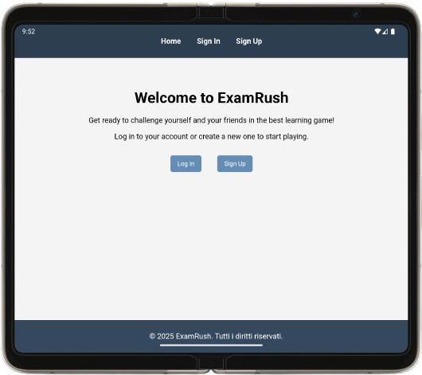
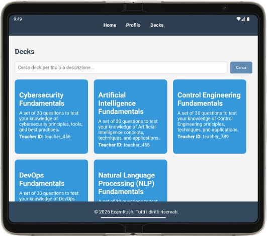

# ExamRush

ExamRush is a mobile application designed to help students study interactively through multiple-choice quizzes. Users can create a profile, choose a question deck, and answer using both touch and the phone's motion sensor.

## Key Features

- **Firebase Authentication** for user registration and login.
- **User profile management**, including profile picture upload and editing.
- **Profile picture cartoonization** using OpenCV.
- **Multiple-choice question decks** for interactive challenges.
- **Navigation between questions** via button or by shaking the phone.
- **Docker-based backend**, with Flask for the CRUD interface, MinIO for image storage, and MongoDB for data management.

## Requirements and Implementation

| Requirement            | Implementation                                                   |
|------------------------|-----------------------------------------------------------------|
| **Use Cloud Services** | Firebase for authentication, MinIO for image storage          |
| **Multi-users**        | Support for multiple users with separate accounts             |
| **Graphics**           | Interactive and animated UI with image management             |
| **Sensors**            | Accelerometer for switching to the next question              |
| **Camera/Image**       | Profile picture upload and cartoon filter with OpenCV         |
| **Concurrency**        | Flask backend managed with Docker for scalability             |
| **Authentication**     | Firebase Authentication for login and registration            |
| **Others**             | Implementation of an image storage system using MinIO         |
| **CRUD interface**     | REST API with Flask for data management                       |
| **Data storage**       | MongoDB for user information and MinIO for images             |

## Project Structure

- **Frontend**: Mobile application written in **Kotlin**
- **Backend**: **Flask REST API**, managed with **Docker**
- **Database**: **MongoDB** for users and questions
- **Image Storage**: **MinIO** for saving profile pictures

## Screenshots

Here are some images of the application:

### Home Page



### Deck Selection



### Quiz Questions

*Add more images here if needed.*

## Installation and Startup

1. Clone the repository:
   ```bash
   git clone https://github.com/your-user/examrush.git
   cd examrush

   ```
2. Start the backend with Docker:
   ```
   docker-compose up -d
   ```
3. Open the mobile application in **Android Studio**, then launch the emulator or connect a physical device.
